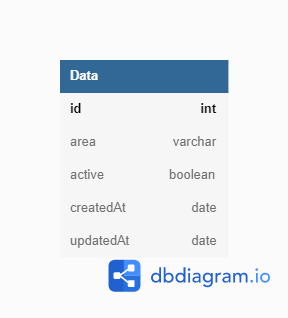
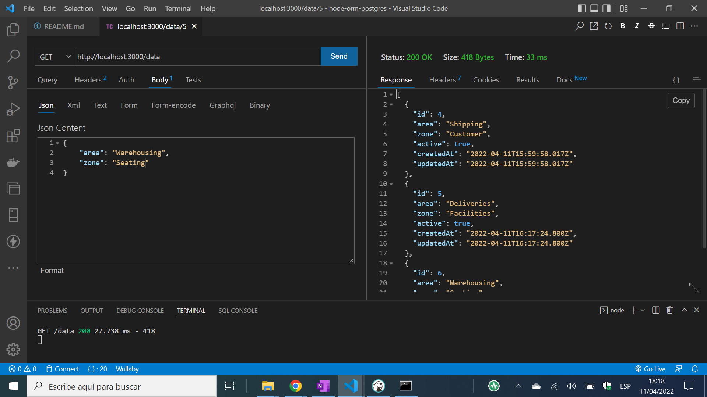

# :zap: Node ORM Postgres

* Node.js backend using TypeORM (an ORM - Object Relational Mapping) and Typescript to create a data Entity model and perform CRUD operations on the data in a PostgreSQL database
* Angular frontend with Tailwind styling to display Field and Project data from backend
* **Note:** to open web links in a new window use: _ctrl+click on link_


## :page_facing_up: Table of contents

* [:zap: Node ORM Postgres](#zap-node-orm-postgres)
  * [:page_facing_up: Table of contents](#page_facing_up-table-of-contents)
  * [:books: General info](#books-general-info)
  * [:camera: Screenshots](#camera-screenshots)
  * [:signal_strength: Technologies](#signal_strength-technologies)
  * [:floppy_disk: Setup](#floppy_disk-setup)
  * [:wrench: Testing](#wrench-testing)
  * [:computer: Code Examples](#computer-code-examples)
  * [:cool: Features](#cool-features)
  * [:clipboard: Status & To-Do List](#clipboard-status--to-do-list)
  * [:clap: Inspiration/General Tools](#clap-inspirationgeneral-tools)
  * [:file_folder: License](#file_folder-license)
  * [:envelope: Contact](#envelope-contact)

## :books: General info

* TypeORM makes creating and accessing a database easier and can be used with any relational database. A typeORM entity is a class with attributes that maps to a database table with columns - like a model
* Data created is based on my site experience at the LNG extraction facility on Melkoya island in Hammerfest, Norway where everything is divided up into areas and zones. The Norsk data is based on all the Norwegian oil rigs in the North Sea
* An interesting problem occured during import of Norwegian CSV data - Norwegian characters were not recognised. Postgres needs to use the LATIN4 character set (Northern European). Default is UTF8 (viewable from pgAdmin `Catalogs/Catalog Objects/character_sets/Columns`).
* Code includes routes & controllers to perform Create, Read, Update and Delete (CRUD) operations.
* Code created in Typescript that is transpiled into javascript using [Node package ts-node](https://www.npmjs.com/package/ts-node)

* Backend Project Structure:

```bash
├── src
│  ├── app.ts
│  ├── controllers
│  │  ├── data.controller.ts
│  │  └── norsk.controller.ts
│  ├── db.ts
│  ├── entity
│  │  ├── Data.ts
│  │  ├── NorskPetroleum.ts
│  │  └── PlantData.ts
│  ├── index.ts
│  └── routes
│    ├── data.routes.ts
│    └── norsk.routes.ts
└── tsconfig.json
```

* Database Overview:



## :camera: Screenshots



## :signal_strength: Technologies

* [Node.js v16](https://nodejs.org/) Javascript (JS) runtime using the [Chrome V8 engine](https://v8.dev/)
* [ts-node v10](https://www.npmjs.com/package/ts-node) Typescript (TS) execution engine and JIT transformation from TS to JS
* [TypeORM v0.3.6](https://typeorm.io/) ORM used with PostgreSQL database. [Github repo here](https://github.com/typeorm/typeorm)
* [PostgreSQL v14](https://www.postgresql.org/) object-relational database
* [DBeaver v22](https://dbeaver.io/) database management tool
* [VS Extension Thunder client](https://www.thunderclient.com/) REST Client for Testing APIs

* [Angular v13](https://angular.io/) framework
* [Tailwindcss v2](https://tailwindcss.com/) CSS framework
* [Reactive Extensions Library for Javascript rxjs v7](https://rxjs.dev/)

## :floppy_disk: Setup

* Assuming you have PostgreSQL database installed, install DBeaver and connect to your PostgreSQL database using DBeaver
* Install dependencies using `npm i`
* Create `.env` and add database credentials - see `.example.env`
* `npm run dev` to start database and create table. I used SQL queries to add data - see `NorskPetroleum.sql`
* Use Thunder client to make CRUD operations using port 3000

## :wrench: Testing

* N/A

## :computer: Code Examples

* `data.controllers.ts` deleteData function using a ternery operator to send status depending on delete operation results

```typescript
 export const deleteData = async (req: Request, res: Response) => {
  const { id } = req.params;
  try {
    return (await NorskPetrol.delete({ id: +id })).affected === 0
      ? res
          .status(404)
          .json({ message: "Matching data not found or not deleted" })
      : res.sendStatus(204);
  } catch (error) {
    if (error instanceof Error) {
      return res.status(500).json({ message: error.message });
    }
  }
};
```

## :cool: Features

* Thunder Client does make testing the database functions much easier using JSON-based CRUD operations.
* TypeORM is easy to use once the data Entity has been set up correctly.

## :clipboard: Status & To-Do List

* Status: Working
* To-Do: backend: update project data. frontend: add home page, nav bar icons

## :clap: Inspiration/General Tools

* [TypeORM documentation](https://typeorm.io/example-with-express)
* [Norwegian & Petroleum Oil Field Data](https://www.norskpetroleum.no/en/facts/field/)
* [Convert CSV to SQL online](https://www.convertcsv.com/csv-to-sql.htm) to generate SQL CREATE & INSERT commands - very useful
* [PostgreSQL - How to list all available tables?](https://tableplus.com/blog/2018/04/postgresql-how-to-list-all-tables.html)
* [PostgreSQL docs 24.3. Character Set Support](https://www.postgresql.org/docs/current/multibyte.html#MULTIBYTE-CHARSET-SUPPORTED)

## :file_folder: License

* This project is licensed under the terms of the MIT license.

## :envelope: Contact

* Repo created by [ABateman](https://github.com/AndrewJBateman), email: gomezbateman@yahoo.com
